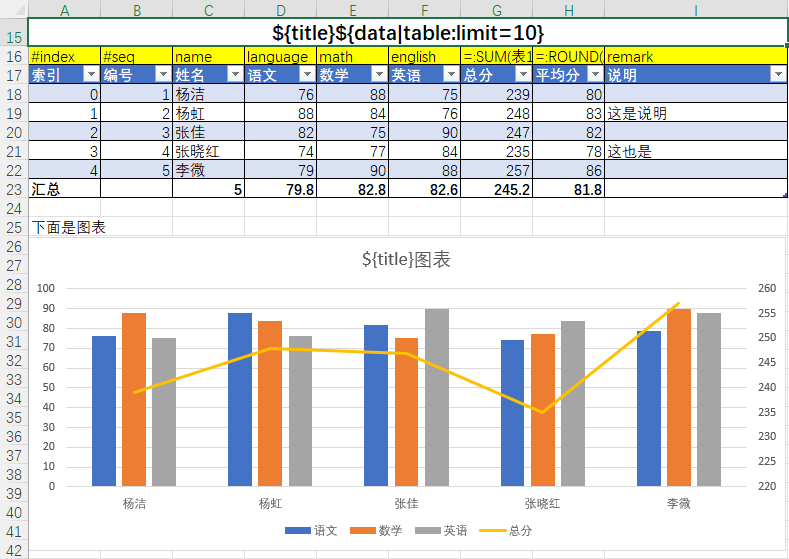
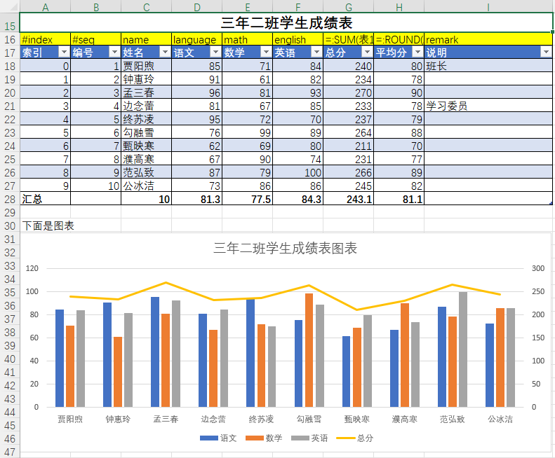

# TemplateGo
一款基于.NET Core的跨平台文档模板标记处理工具。

查找并替换文档中特殊标记，并支持图片、超链接、表格处理。
| 模板   |      数据      |  输出 |
|-------|---------------|-------|
| Hello ${name} | {name: "Alice"} | Hello Alice |
| ${home\|link:content} | {home: "https://yanglb.com", content: "Home Page"} | [Home Page](https://yanglb.com) |
| ${avatar\|image:wf=2cm} | {avatar: "path-to-image"} |  |
> 更多内容请参考下文

## 限制
1. 暂不支持Word文档，今后有空时会添加Word模板处理。
2. 对 Excel 公式支持还不够完整。
3. 插入图片时位置及对齐方式还有些问题。

## 开始
### 安装
```sh
dotnet add package TemplateGO

# 支持 Windows、Linux、MacOS
```

### 使用
```c#
var templateFile = "{template file path}";
var jsonString = "{json data}";
TemplateGO.Render(templateFile, jsonString, "out.xlsx");
```

### 测试
```sh
git clone git@github.com:yanglb/template-go.git
cd template-go

dotnet build && dotnet test

# 测试结果:
ls -lh TemplateGOTests/out 
```

## 文档
### 模板语法
${ **property** [| **processor** [: **options** ]]}

### property 属性路径
指示 TemplateGO 如何从JSON数据中获取要插入的内容。

如下所示:
```js
// data:
{
  "name": "Alice",
  "score": [{
    "course": "physics",
    "score": 85
  }],
  "school": {
    "name": "北京大学",
    "address": "北京市海淀区"
  }
}

// property:
// name => Alice
// score[0].score => 85
// school.name => "北京大学"
// notExists => undefined
```

### processor 处理单元
指定数据处理单元，目前支持以下几种:
| 处理单元  |  作用  |  说明 |
|:------|:--------------|:------|
| value (default) | 文字替换 | **默认** 使用property属性值替换标记块。<br /> **Excel:** 如果单元格仅包含该标记块，则根据JSON数据类型自动设置单元格数据类型。|
| link | 超链接 | 将property所指内容视为链接地址，向文档添加超链接。 |
| image | 图片 | 将property所指内容视为图片并插入到标记块所在位置。<br />支持本地文件、base64编码图片以及网络图片。 |
| qr | 二维码 | 通过property所指内容生成二维码并插入到标记块所在位置。|
| table | 表格 | 向文档添加列表数据，property所指属性必需为数组。 |

### value 文字替换
#### 语法
> \${**property**} 或 ${**property**|value}

其中value为默认处理单元，可省略。

#### 示例
```json
{"name": "Alice", "age": 18, "school": {}, "graduated": false }
```
| 标记块 | 输出 | 说明 |
| ----  | ---- | ---- |
| ${name} | Alice | 单元格类型为 String |
| ${age} | 18 | 单元格类型为 Number |
| Age: ${age} | Age: 18 | 单元格类型为 String |
| ${graduated} | FALSE | 单元格类型为 Boolean |
| Is Graduated: ${graduated} | IS Graduated: FALSE | 单元格类型为 String |
| ${school} | [object Object] | TemplateGO 会将 JSON 中 Object或Array 转为 [object Object] 字符串。|
| ${notExists} |  | JSON 中不存在的属性将不输出任何内容。 |

**Excel:** 如果单元格仅包含该标记块，则单元格数据类型将根据JSON数据设置。

### link 超链接
#### 语法
> ${property|link[:options]}

#### 选项
| 名称 | 类型 | 默认值 | 说明
| -- | -- | -- | -- |
| **content** | String |  | 链接内容，如用英文引号("")包裹则视为字符串直接插入，否则将其当作属性key从JSON数据中获取。 |
* property 作为链接地址，如 https://yanglb.com
* content 作为链接显示内容，如 首页

#### 示例
```json
{"title": "Home Page", "url": "https://yanglb.com" }
```
| 标记块 | 输出 | 说明 |
| ----  | ---- | ---- |
| ${url\|link:title} | [Home Page](https://yanglb.com) | 输出超链接 |
| ${url\|link:"Test Page"} | [Test Page](https://yanglb.com) | 输出超链接 |
| My Home Page${url\|link} | [My Home Page](https://yanglb.com) | **Excel 特有用法** Excel将超链接作用到单元格之上，因此整个单元格可点击。 |

### image 图片
#### 语法
> ${property|image[:options]}

#### 选项
| 名称 | 类型 | 默认值 | 说明
| -- | -- | -- | -- |
| **padding** | String | 0 | 指定图片内边距，偏离所在单元格起始位置。 |
| **fw** | String | | 指定图片外框宽度。 |
| **fh** | String | | 指定图片外框高度。 |
| **deleteMarked** | Boolean | false | 指示是否在插入图片后删除位于同一单元格之上的图片。<br />JSON中指定的图片不存在时不会删除。<br />主要用于在设计模板时添加样例或默认图片，但希望在生成的文档中优先使用JSON中的图片的场景。 |
**padding/fw/fh 支持以下单位：**
* cm 厘米
* in 英寸
* px 像素

**外框及边距说明**
> fw/fh 并非控制图片尺寸，而是限制图片大小范围。

* 仅设置 fw 时图片宽度调整为 fw 值，高度按比例缩放。
* 仅设置 fh 时图片高度调整为 fh 值，宽度按比例缩放。
* 同时设置 fw/fh 时长边对齐，短边按比例缩放后居中对齐显示[^1]

#### 示例
```json
{
  "file": "path-to-image", 
  "url": "https://avatars.githubusercontent.com/u/6257395?s=40&v=4",
  "base64": "data:image/png;base64,xxxxx"
}
```
| 标记块 | 输出 | 说明 |
| ----  | ---- | ---- |
| ${url\|image} |  <br />_(用于演示)_ | 将 url 中的图片插入到标记所在位置，且保持原始大小。 |
| ${file\|image:padding=0.5cm, fw=2cm, fh=2cm} |  <br />_(用于演示)_ | 将 file 图片插入到标记所在单元格中，图片位于单元格左上角 0.5cm 处。<br />宽度或高度为2cm（长边=2cm 短边按比例缩放，并居中显示[^1]） |
| ${base64\|image:deleteMarked} |  <br />_(用于演示)_ | 将 base64 内容做为图片插入到标记所在位置，如果base64不为空则删除原先在该位置的图片。 |

### qr 二维码
#### 语法
> ${property|qr[:options]}

使用property所指内容生成二维码图片，然后使用与 **image** 相同的行为插入到文档中。

选项、示例请参考 [image](#image-图片)

### table 表格
仅支持在Excel中使用


#### 语法
> 请在模板中按以下顺序设置: 
1. **${property|table[:options]}** => 标记块
2. **columns** => 列选项
3. **[title]** => 标题行（可选）
4. **[sample]** => 样例数据（可选）
5. **[other]** => 其它内容（可选）

#### options 选项
| 名称 | 类型 | 默认值 | 说明
| -- | -- | -- | -- |
| **titleCount** | number | 1 | 标题行数量，默认为1。 |
| **sampleCount** | number | 0 | 设计模板时添加的样本数据条数。当所在区域为表格时此选项无效。 |
| **limit** | number | 不限制 | 限制最多插入数据条目数，默认为 property 所指数据的全部内容。 |

#### columns列选项
定义表格中每一列要插入的内容或属性名。

| column值 | 名称 | 示例 | 说明 |
| --- | --- | --- | -- |
| #index | 索引 | 0 | 此列插入数组索引值，从0开始。 |
| #seq | 序列 | 1 | 此列插入数组序列值，从1开始。 #seq = #index + 1 。|
| #row | 行号 | 1 | 此例插入行号。 |
| #value | 值 | "张三" | 此列插入数组值，用于插入非Object/Array类型的列表数据。 |
| =formulaProperty | 公式属性 | =sumScore | 获取JSON数据中formulaProperty所指内容并作为公式插入到此列中。 |
| =:formual | 字符公式 | =:SUM(表1[[#This Row],[语文]:[英语]]) | 将 formual 作为公式插入到此列中。 |
| - | 留空 | | 此列留空不插入任何内容。 |
| _property_ | 属性 | name | 通过 property 属性获取数组中当前对象的值，并插入此列。|

> 当插入字符公式时（=:formual）以下字符会替换为相应值
> * #index
> * #seq
> * #row

#### title标题行
【可选】 可为表格添加由 **titleCount** 中设置数量的标题行。

#### sample样例数据
【可选】 可为表格添加由 **sampleCount** 中设置数量的样例数据，方便设计模板。

#### other其它内容
【可选】 可为表格添加其它内容，如汇总行等[^2]。

#### 示例
**模板**



**数据**
```json
{
  "-": "以下数据为随机生成的测试数据，并非真实学生信息。",
  "title": "三年二班学生成绩表",
  "data": [
    {"name": "贾阳煦", "language":85, "math":71, "english":84, "remark": "班长"},
    {"name": "钟惠玲", "language":91, "math":61, "english":82},
    {"name": "孟三春", "language":96, "math":81, "english":93},
    {"name": "边念蕾", "language":81, "math":67, "english":85, "remark": "学习委员"},
    {"name": "终苏凌", "language":95, "math":72, "english":70},
    {"name": "勾融雪", "language":76, "math":99, "english":89},
    {"name": "甄映寒", "language":62, "math":69, "english":80},
    {"name": "濮高寒", "language":67, "math":90, "english":74},
    {"name": "范弘致", "language":87, "math":79, "english":100},
    {"name": "公冰洁", "language":73, "math":86, "english":86}
  ]
}
```
**结果**




[^1]: Microsoft Excel中显示还有问题，LibreOffice正常。

[^2]: 目前对公式支持不友好，如需要汇总等统计时请将区域转为表格并使用表格提供的相关公式处理。

## License
Copyright (c) yanglb.com. All rights reserved.

Licensed under the MIT license.
